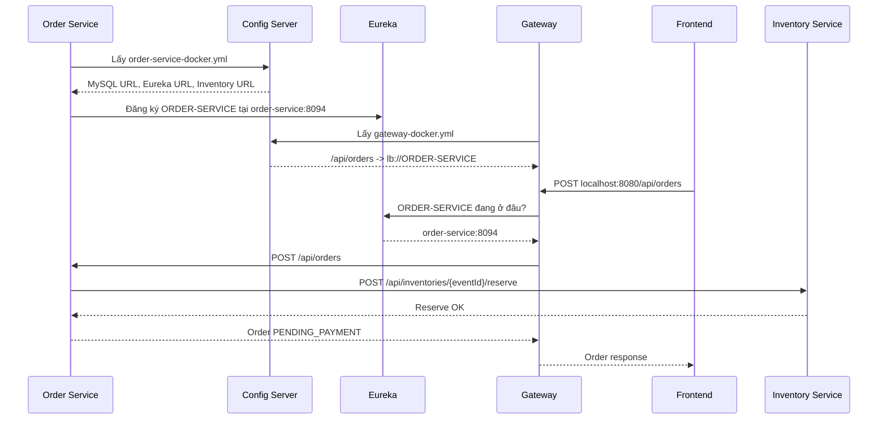

# Phase 8 - Hiểu Config Server, Eureka Và Gateway

Tài liệu này giải thích lại hai ý quan trọng trong Phase 8:

- Vì sao tách config ra Config Server.
- Vì sao frontend gọi qua Gateway thay vì gọi thẳng từng service.

Mục tiêu: sau khi hiểu, bạn có thể tự thêm service mới như `payment-service`, `ticket-service`, `booking-service`.

---

## 1. Đừng trộn hai luồng

Có hai luồng khác nhau:

1. Luồng service khởi động.
2. Luồng người dùng gọi API.

Hai luồng này dùng các thành phần khác nhau.

### Luồng service khởi động

Service cần biết:

- database nằm ở đâu
- Eureka nằm ở đâu
- service khác nằm ở đâu
- profile đang chạy là `dev` hay `docker`

Luồng này dùng:

- Config Server
- Eureka

### Luồng người dùng gọi API

Frontend cần gọi API backend.

Frontend không nên biết từng service chạy port nào.

Luồng này dùng:

- Gateway
- Eureka

---

## 2. Ví dụ đời thường

Hãy coi hệ thống như một khu văn phòng.

- Config Server = tủ tài liệu chung.
- Eureka = bảng danh bạ phòng ban đang hoạt động.
- Gateway = lễ tân.
- Order Service = phòng xử lý đơn hàng.
- Inventory Service = phòng quản lý vé.
- Frontend = khách hàng.

### Config Server làm gì?

Trong tủ tài liệu ghi:

```text
Phòng Order dùng database nào?
Phòng Order gọi Inventory ở đâu?
Phòng Order đăng ký Eureka ở đâu?
```

Config Server chỉ cung cấp cấu hình.

Config Server không xử lý nghiệp vụ đặt vé.

Config Server không chuyển request của user.

### Eureka làm gì?

Eureka giống bảng danh bạ.

Nó ghi:

```text
ORDER-SERVICE đang chạy ở đâu?
INVENTORY-SERVICE đang chạy ở đâu?
GATEWAY đang chạy ở đâu?
```

Eureka quản lý service nào đang sống và địa chỉ hiện tại của service đó.

### Gateway làm gì?

Gateway giống lễ tân.

Khách hàng không tự đi tìm phòng Order.

Khách hàng chỉ gọi lễ tân:

```text
POST /api/orders
```

Gateway nhìn đường dẫn API, hỏi Eureka địa chỉ `ORDER-SERVICE`, rồi chuyển request tới đó.

---

## 3. Luồng thứ nhất: service khởi động

Khi `order-service` khởi động, chưa có request nào từ frontend.

Nó cần lấy cấu hình trước.

### Bước 1: Order Service biết tên mình

File:

```text
order-service/src/main/resources/application.yml
```

Nội dung chính:

```yaml
spring:
  application:
    name: order-service
```

Ý nghĩa:

```text
Tên service này là order-service.
```

Tên này dùng cho hai việc:

- Config Server tìm đúng file config.
- Eureka đăng ký đúng tên service.

---

### Bước 2: Order Service biết Config Server ở đâu

Cũng trong file:

```text
order-service/src/main/resources/application.yml
```

Có dòng:

```yaml
spring:
  config:
    import: optional:configserver:http://localhost:8888
```

Ý nghĩa:

```text
Khi khởi động, hãy tới Config Server ở http://localhost:8888 để lấy cấu hình.
```

`optional` nghĩa là:

```text
Nếu Config Server chưa chạy, app vẫn có thể tiếp tục khởi động nếu đủ config local.
```

Trong Docker, dòng này được ghi đè bằng biến môi trường:

```yaml
SPRING_CONFIG_IMPORT: configserver:http://config:8888
```

Vì trong Docker, Config Server có tên service là `config`, không phải `localhost`.

---

### Bước 3: Config Server chọn file config

Config Server chọn file theo công thức:

```text
{spring.application.name}-{profile}.yml
```

Với order-service:

```text
spring.application.name = order-service
```

Nếu chạy profile `dev`:

```text
order-service-dev.yml
```

Nếu chạy profile `docker`:

```text
order-service-docker.yml
```

---

### Bước 4: Config local dùng `localhost`

File:

```text
environment/config-repo/order-service-dev.yml
```

Ví dụ:

```yaml
spring:
  datasource:
    url: jdbc:mysql://localhost:3306/order_service_db
    username: root
    password: root

eureka:
  client:
    service-url:
      defaultZone: http://localhost:8761/eureka/

inventory:
  service:
    base-url: http://localhost:8093
```

Khi chạy trực tiếp bằng IntelliJ hoặc Maven:

```text
Order Service      localhost:8094
Inventory Service  localhost:8093
Config Server      localhost:8888
Eureka             localhost:8761
MySQL              localhost:3306
```

Tất cả chạy trên máy Windows của bạn.

Vì vậy `localhost` nghĩa là máy Windows của bạn.

---

### Bước 5: Config Docker dùng tên service

File:

```text
environment/config-repo/order-service-docker.yml
```

Ví dụ:

```yaml
spring:
  datasource:
    url: jdbc:mysql://mysql:3306/order_service_db
    username: root
    password: root

eureka:
  client:
    service-url:
      defaultZone: http://discovery:8761/eureka/

inventory:
  service:
    base-url: http://inventory-service:8093
```

Trong Docker, mỗi container giống một máy riêng.

Đứng bên trong container `ticket-order-service`:

```text
localhost
```

nghĩa là:

```text
chính container ticket-order-service
```

Nó không phải MySQL.

Nó không phải Inventory Service.

Nó không phải Discovery.

Vì vậy Docker dùng tên service:

```text
mysql
inventory-service
config
discovery
```

Ví dụ:

```text
http://inventory-service:8093
```

nghĩa là:

```text
Gọi container/service tên inventory-service, port 8093.
```

---

## 4. Vì sao code Java không đổi?

Trong code:

```text
order-service/src/main/java/com/ticketsale/order/client/InventoryClient.java
```

Có đoạn:

```java
public InventoryClient(
        RestClient.Builder restClientBuilder,
        @Value("${inventory.service.base-url}") String inventoryBaseUrl
) {
    this.restClient = restClientBuilder
            .baseUrl(inventoryBaseUrl)
            .build();
}
```

Java chỉ nói:

```text
Cho tôi giá trị inventory.service.base-url.
```

Java không tự ghi cứng:

```text
http://localhost:8093
```

Java cũng không tự ghi cứng:

```text
http://inventory-service:8093
```

Giá trị này đến từ Config Server.

### Khi chạy local

Config Server trả:

```yaml
inventory:
  service:
    base-url: http://localhost:8093
```

Java nhận:

```text
http://localhost:8093
```

### Khi chạy Docker

Config Server trả:

```yaml
inventory:
  service:
    base-url: http://inventory-service:8093
```

Java nhận:

```text
http://inventory-service:8093
```

Code gọi inventory vẫn y hệt:

```java
restClient.post()
        .uri("/api/inventories/{eventId}/reserve", eventId);
```

URL hoàn chỉnh khi local:

```text
http://localhost:8093/api/inventories/1001/reserve
```

URL hoàn chỉnh khi Docker:

```text
http://inventory-service:8093/api/inventories/1001/reserve
```

Đây là ý nghĩa của câu:

```text
Local/Docker chỉ khác file config, code không đổi.
```

---

## 5. Sau khi lấy config, service đăng ký Eureka

Sau khi `order-service` lấy được config, nó biết Eureka nằm ở đâu.

Ví dụ Docker:

```yaml
eureka:
  client:
    service-url:
      defaultZone: http://discovery:8761/eureka/
```

Sau đó `order-service` tự đăng ký vào Eureka:

```text
Tên: ORDER-SERVICE
Địa chỉ: order-service:8094
Trạng thái: UP
```

Eureka lúc này giống danh bạ:

```text
ORDER-SERVICE      -> order-service:8094
INVENTORY-SERVICE  -> inventory-service:8093
USER-SERVICE       -> user-service:8091
EVENT-SERVICE      -> event-service:8092
GATEWAY            -> gateway:8080
```

Quan trọng:

```text
Config Server không đăng ký service thay ai.
```

Đúng luồng là:

```text
Order Service lấy config
Order Service biết Eureka nằm đâu
Order Service tự đăng ký vào Eureka
```

---

## 6. Luồng thứ hai: frontend gọi API

Sau khi service đã khởi động xong, user bắt đầu gọi API.

Frontend muốn tạo order.

Frontend gọi:

```text
POST http://localhost:8080/api/orders
```

Port `8080` là Gateway.

Frontend không cần gọi trực tiếp:

```text
http://localhost:8094/api/orders
```

---

## 7. Gateway route là gì?

File:

```text
environment/config-repo/gateway-docker.yml
```

Route order-service:

```yaml
- id: order-service
  uri: lb://ORDER-SERVICE
  predicates:
    - Path=/api/orders,/api/orders/**
```

Giải thích từng dòng.

### `id`

```yaml
id: order-service
```

Đây là tên route trong Gateway.

Nó giúp đọc log và phân biệt route.

---

### `predicates`

```yaml
predicates:
  - Path=/api/orders,/api/orders/**
```

Nghĩa là:

```text
Nếu request có path khớp /api/orders hoặc /api/orders/** thì dùng route này.
```

`/api/orders` dùng cho:

```text
POST /api/orders
```

`/api/orders/**` dùng cho:

```text
GET /api/orders/ORD-123
GET /api/orders/ORD-123/checkout
```

Vì vậy cần cả hai.

Nếu chỉ viết:

```yaml
Path=/api/orders/**
```

thì có thể không match chính xác:

```text
POST /api/orders
```

---

### `uri`

```yaml
uri: lb://ORDER-SERVICE
```

Tách ra:

```text
lb://
ORDER-SERVICE
```

`ORDER-SERVICE` là tên service trong Eureka.

Tên này đến từ:

```yaml
spring:
  application:
    name: order-service
```

Eureka thường hiển thị service name dạng chữ hoa:

```text
ORDER-SERVICE
```

`lb://` nghĩa là:

```text
Dùng load balancer, không dùng địa chỉ cứng.
Hãy hỏi Eureka xem ORDER-SERVICE đang nằm ở đâu.
```

---

## 8. Gateway chuyển request như nào?

Frontend gọi:

```text
POST http://localhost:8080/api/orders
```

Gateway nhận request.

Gateway kiểm tra route:

```text
/api/orders khớp route order-service
```

Gateway thấy:

```text
uri = lb://ORDER-SERVICE
```

Gateway hỏi Eureka:

```text
ORDER-SERVICE đang chạy ở đâu?
```

Eureka trả:

```text
order-service:8094
```

Gateway chuyển request tới:

```text
http://order-service:8094/api/orders
```

Frontend không cần biết chuyện này.

Frontend chỉ biết:

```text
Gọi localhost:8080 là đủ.
```

---

## 9. Toàn bộ flow Phase 8

### Khi Docker start

```text
docker compose up
    ↓
config service chạy
    ↓
discovery service chạy
    ↓
inventory-service lấy config từ config service
    ↓
inventory-service đăng ký INVENTORY-SERVICE vào Eureka
    ↓
order-service lấy config từ config service
    ↓
order-service biết inventory-service và discovery nằm đâu
    ↓
order-service đăng ký ORDER-SERVICE vào Eureka
    ↓
gateway lấy route từ config service
    ↓
gateway biết /api/orders đi tới lb://ORDER-SERVICE
```

### Khi user tạo order

```text
Frontend
    ↓
POST localhost:8080/api/orders
    ↓
Gateway
    ↓
hỏi Eureka: ORDER-SERVICE ở đâu?
    ↓
Eureka trả order-service:8094
    ↓
Gateway chuyển request tới order-service
    ↓
Order Service gọi Inventory Service reserve vé
    ↓
Inventory Service giảm available_quantity
    ↓
Order Service lưu order trạng thái PENDING_PAYMENT
    ↓
Frontend nhận orderNo, status, expiresAt
```

---

## 10. Sơ đồ sequence



---

## 11. Cách tự kiểm tra khi chạy Docker

### Bước 1: xem Config Server trả config cho order

```powershell
curl.exe "http://localhost:8888/order-service/docker"
```

Cần thấy các giá trị Docker:

```text
jdbc:mysql://mysql:3306/order_service_db
http://discovery:8761/eureka/
http://inventory-service:8093
```

Nếu thấy `localhost` trong profile docker, config sai.

---

### Bước 2: xem Eureka UI

Mở:

```text
http://localhost:8761
```

Cần thấy:

```text
ORDER-SERVICE
INVENTORY-SERVICE
GATEWAY
```

Nếu không thấy `ORDER-SERVICE`, order-service chưa đăng ký Eureka.

Kiểm tra:

- `spring.application.name`
- `eureka.client.service-url.defaultZone`
- service có dependency Eureka Client chưa
- container order-service có healthy không

---

### Bước 3: gọi thẳng order-service

```powershell
curl.exe "http://localhost:8094/actuator/health"
```

Cần thấy:

```json
{"status":"UP"}
```

Nếu bước này fail, order-service chưa sống.

---

### Bước 4: gọi qua Gateway

```powershell
curl.exe "http://localhost:8080/api/orders/ORD-XXX/checkout"
```

Nếu gọi thẳng `8094` được nhưng gọi qua `8080` fail, lỗi thường nằm ở Gateway route hoặc Eureka.

Kiểm tra:

- `gateway-docker.yml`
- route `Path=/api/orders,/api/orders/**`
- `uri: lb://ORDER-SERVICE`
- Eureka có `ORDER-SERVICE` chưa

---

## 12. Khi tự thêm service mới

Ví dụ bạn thêm `payment-service`.

### Bước 1: đặt tên service

File:

```text
payment-service/src/main/resources/application.yml
```

```yaml
spring:
  application:
    name: payment-service

  config:
    import: optional:configserver:http://localhost:8888

server:
  port: 8095
```

---

### Bước 2: thêm Config Client

File:

```text
payment-service/pom.xml
```

```xml
<dependency>
    <groupId>org.springframework.cloud</groupId>
    <artifactId>spring-cloud-starter-config</artifactId>
</dependency>
```

Để service đọc được config từ Config Server.

---

### Bước 3: thêm Eureka Client

File:

```text
payment-service/pom.xml
```

```xml
<dependency>
    <groupId>org.springframework.cloud</groupId>
    <artifactId>spring-cloud-starter-netflix-eureka-client</artifactId>
</dependency>
```

Để service tự đăng ký vào Eureka.

---

### Bước 4: tạo config local

File:

```text
environment/config-repo/payment-service-dev.yml
```

```yaml
spring:
  datasource:
    url: jdbc:mysql://localhost:3306/payment_service_db
    username: root
    password: root

eureka:
  client:
    service-url:
      defaultZone: http://localhost:8761/eureka/
```

Local dùng `localhost`.

---

### Bước 5: tạo config Docker

File:

```text
environment/config-repo/payment-service-docker.yml
```

```yaml
spring:
  datasource:
    url: jdbc:mysql://mysql:3306/payment_service_db
    username: root
    password: root

eureka:
  client:
    service-url:
      defaultZone: http://discovery:8761/eureka/
```

Docker dùng tên service/container.

---

### Bước 6: thêm Dockerfile

File:

```text
payment-service/Dockerfile
```

```dockerfile
FROM eclipse-temurin:21-jre
WORKDIR /app
COPY target/payment-service-1.0-SNAPSHOT.jar app.jar
ENTRYPOINT ["java", "-jar", "/app/app.jar"]
```

---

### Bước 7: thêm vào docker-compose

File:

```text
docker-compose.yml
```

```yaml
payment-service:
  build:
    context: ./payment-service
    dockerfile: Dockerfile
  restart: unless-stopped
  container_name: ticket-payment-service
  profiles: [ "platform" ]
  environment:
    SPRING_PROFILES_ACTIVE: docker
    SPRING_CONFIG_IMPORT: configserver:http://config:8888
    EUREKA_CLIENT_SERVICEURL_DEFAULTZONE: http://discovery:8761/eureka/
  ports:
    - "8095:8095"
  depends_on:
    mysql:
      condition: service_healthy
    discovery:
      condition: service_started
    config:
      condition: service_healthy
```

---

### Bước 8: thêm Gateway route

File:

```text
environment/config-repo/gateway-dev.yml
environment/config-repo/gateway-docker.yml
```

```yaml
- id: payment-service
  uri: lb://PAYMENT-SERVICE
  predicates:
    - Path=/api/payments,/api/payments/**
```

---

## 13. Công thức nhớ

```text
application.yml
= service tên gì, port bao nhiêu, Config Server ở đâu

service-dev.yml
= địa chỉ khi chạy trực tiếp trên máy

service-docker.yml
= địa chỉ khi chạy trong Docker

Config Server
= nơi service lấy cấu hình

Eureka
= nơi service đăng ký địa chỉ đang sống

Gateway
= cửa vào duy nhất cho frontend
```

Câu nhớ ngắn:

```text
Service lấy config từ Config Server.
Service đăng ký địa chỉ vào Eureka.
Frontend gọi Gateway.
Gateway hỏi Eureka để tìm service thật.
```
