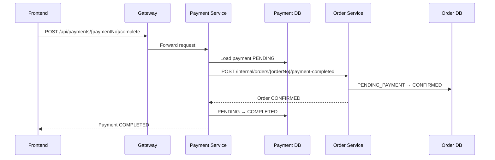
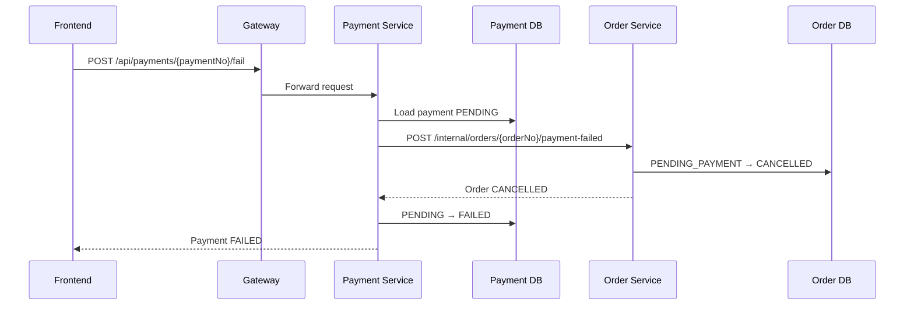

# Thiết kế Phase 10 - Payment service

Ngày: 04/08/2026  
Trạng thái: Đã duyệt hướng triển khai

## 1. Mục tiêu

Xây dựng `payment-service` để mô phỏng thanh toán thành công hoặc thất bại, sau đó cập nhật trạng thái order qua HTTP đồng bộ.

Kết quả cần đạt:

```text
Order PENDING_PAYMENT
        ↓
Payment PENDING
        ↓
COMPLETED hoặc FAILED
        ↓
Order CONFIRMED hoặc CANCELLED
```

Phase 10 được chia thành:

- Phase 10.1: payment-service hoạt động độc lập.
- Phase 10.2: payment-service gọi order-service để cập nhật order.

## 2. Phạm vi Phase 10.1

Tạo một service mới theo cấu trúc các domain service hiện tại:

- Spring Boot Web.
- Spring Data JPA.
- Flyway.
- MySQL database riêng `payment_service_db`.
- Spring Cloud Config Client.
- Eureka Client.
- Actuator.
- Dockerfile và Docker Compose.

Payment v1 có ba trạng thái:

```text
PENDING
COMPLETED
FAILED
```

Transition hợp lệ:

```text
PENDING → COMPLETED
PENDING → FAILED
```

Gọi lại cùng transition phải idempotent:

```text
COMPLETED → COMPLETED = trả payment hiện tại
FAILED → FAILED = trả payment hiện tại
```

Transition ngược phải bị từ chối:

```text
COMPLETED → FAILED = 409 Conflict
FAILED → COMPLETED = 409 Conflict
```

## 3. Phạm vi Phase 10.2

Khi payment đổi trạng thái, payment-service gọi HTTP sang order-service:

```text
Payment COMPLETED → Order CONFIRMED
Payment FAILED    → Order CANCELLED
```

Payment-service không được truy cập trực tiếp database của order-service.

Giao tiếp tạm thời dùng HTTP đồng bộ để dễ học và kiểm thử. Phase 11 sẽ thay phần này bằng Kafka và Outbox.

## 4. Ngoài phạm vi

Phase này chưa làm:

- Tích hợp cổng thanh toán thật.
- Giá vé, tiền tệ và tính tổng tiền.
- Hoàn tiền.
- Kafka và Outbox.
- Consumer idempotent.
- Tự động hủy order hết hạn.
- Release inventory khi payment thất bại hoặc order hết hạn.
- Authentication và lấy user từ JWT.

`amount` chưa được lưu vì order hiện tại chưa có dữ liệu giá. Thêm `amount` khi domain pricing được xây dựng.

## 5. Quyền sở hữu dữ liệu

### Payment-service sở hữu

- Payment number.
- Order number liên kết.
- Payment status.
- Lý do thất bại.
- Thời điểm tạo và cập nhật.

### Order-service sở hữu

- Order status.
- Thời gian thanh toán hết hạn.
- Quyết định order có được confirm hoặc cancel hay không.

Payment-service chỉ gửi yêu cầu chuyển trạng thái. Order-service tự kiểm tra transition hợp lệ.

## 6. Thiết kế bảng payments

```sql
create table payments
(
    id             bigint primary key auto_increment,
    payment_no     varchar(100) not null,
    order_no       varchar(100) not null,
    status         varchar(50)  not null,
    failure_reason varchar(255) null,
    created_at     datetime     not null,
    updated_at     datetime     not null,

    unique key uk_payments_payment_no (payment_no),
    unique key uk_payments_order_no (order_no)
);
```

Một order chỉ có một payment record trong Payment v1. Retry dùng lại record cũ thay vì tạo thêm record.

## 7. API payment-service

### Tạo payment

```http
POST /api/payments
Content-Type: application/json

{
  "orderNo": "ORD-123"
}
```

Kết quả:

```json
{
  "paymentNo": "PAY-123",
  "orderNo": "ORD-123",
  "status": "PENDING"
}
```

Nếu order đã có payment, API trả lại payment hiện tại.

Nếu chưa có payment, payment-service gọi order-service để kiểm tra order trước khi tạo:

```text
Order tồn tại
    ↓
Status = PENDING_PAYMENT
    ↓
Thời gian hiện tại < expiresAt
    ↓
Tạo payment PENDING
```

Order không tồn tại trả `404 Not Found`. Order đã confirm, cancel hoặc hết thời gian thanh toán trả `409 Conflict`.

### Thanh toán thành công

```http
POST /api/payments/{paymentNo}/complete
```

Kết quả:

- Payment chuyển sang `COMPLETED`.
- Order chuyển sang `CONFIRMED`.

### Thanh toán thất bại

```http
POST /api/payments/{paymentNo}/fail
Content-Type: application/json

{
  "reason": "PAYMENT_DECLINED"
}
```

Kết quả:

- Payment chuyển sang `FAILED`.
- Order chuyển sang `CANCELLED`.

## 8. API nội bộ của order-service

Payment-service gọi trực tiếp order-service, không đi qua Gateway:

```http
GET  /api/orders/{orderNo}/checkout
POST /internal/orders/{orderNo}/payment-completed
POST /internal/orders/{orderNo}/payment-failed
```

### Khi payment thành công

Order-service xử lý:

```text
PENDING_PAYMENT và chưa hết hạn → CONFIRMED
CONFIRMED                     → trả order hiện tại
CANCELLED hoặc EXPIRED        → 409 Conflict
```

### Khi payment thất bại

Order-service xử lý:

```text
PENDING_PAYMENT → CANCELLED
CANCELLED       → trả order hiện tại
CONFIRMED       → 409 Conflict
EXPIRED         → trả trạng thái hiện tại
```

## 9. Luồng thanh toán thành công



Order-service được cập nhật trước payment-service. Nếu việc lưu payment thất bại, client retry endpoint `complete`; order-service trả lại `CONFIRMED`, sau đó payment-service có thể hoàn tất payment.

## 10. Luồng thanh toán thất bại



## 11. Xử lý lỗi

- `400 Bad Request`: request body không hợp lệ.
- `404 Not Found`: không tìm thấy payment hoặc order.
- `409 Conflict`: transition trạng thái không hợp lệ.
- `502 Bad Gateway`: payment-service không gọi được order-service.

Các exception nghiệp vụ phải được map thành `ApiResponse.fail(...)` giống các service hiện tại.

## 12. Consistency tạm thời

HTTP đồng bộ không tạo được một transaction chung cho payment DB và order DB.

Phase 10 giảm rủi ro bằng:

- Endpoint chuyển trạng thái order idempotent.
- Endpoint complete/fail payment idempotent.
- Gọi order-service trước, lưu trạng thái payment sau.
- Cho phép client retry cùng endpoint khi lỗi mạng.

Giới hạn còn lại được chấp nhận trong Phase 10. Phase 11 dùng Kafka và Outbox để giảm coupling và xử lý event an toàn hơn.

## 13. Config và Docker

Payment-service dùng:

- Application name: `payment-service`.
- Port local/Docker: `8095`.
- Database: `payment_service_db`.
- Config files: `payment-service-dev.yml` và `payment-service-docker.yml`.
- Gateway route: `/api/payments/**` → `lb://PAYMENT-SERVICE`.
- Order base URL lấy từ Config Server.

Docker Compose thêm `payment-service`, phụ thuộc MySQL, Discovery, Config và Order service.

## 14. Kiểm thử

### Unit test

- Tạo payment mới ở trạng thái `PENDING`.
- Tạo lại payment cho cùng order trả record cũ.
- Complete payment hợp lệ.
- Fail payment hợp lệ.
- Complete lại payment đã completed trả record cũ.
- Transition `FAILED → COMPLETED` trả conflict.
- OrderClient không được gọi lại khi payment đã ở đúng trạng thái cuối.

### Controller test

- API create trả payment.
- API complete trả `COMPLETED`.
- API fail trả `FAILED`.
- Exception nghiệp vụ trả đúng HTTP status.

### Smoke test local/Docker

- Payment-service healthy và đăng ký Eureka.
- Gateway route gọi được payment API.
- Complete payment làm order thành `CONFIRMED`.
- Fail payment làm order thành `CANCELLED`.

## 15. Tiêu chí hoàn thành Phase 10

- Payment-service build và test pass.
- Flyway tạo được bảng `payments`.
- Payment API chạy được qua port `8095` và Gateway `8080`.
- Payment complete/fail cập nhật đúng payment status.
- Order nhận đúng trạng thái `CONFIRMED` hoặc `CANCELLED`.
- Full Docker local stack healthy.
- Nợ consistency HTTP được ghi lại cho Phase 11.
